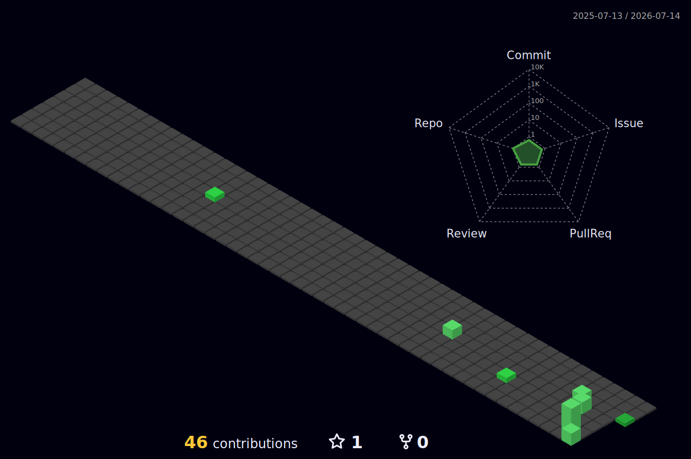

<!--
  MAHDIBUILDS // AXON ZENITH CONTROL PLANE
  Profile repository: https://github.com/MahdiBuilds/MahdiBuilds
-->

<div align="center">

# `MAHDIBUILDS // AXON ZENITH`

### Principal Software Architect · CTO at Feather IT · Senior Lecturer at DIU

[](https://git.io/typing-svg)

<p>
  <a href="https://github.com/MahdiBuilds?tab=repositories">
    
  </a>
  <a href="https://mahdiblogs.com">
    
  </a>
  <a href="https://featheruniverse.com/contact">
    
  </a>
</p>

`BANGLADESH` · `BACKEND ARCHITECTURE` · `DISTRIBUTED SYSTEMS` · `ENGINEERING EDUCATION`

</div>

---

## `$ whoami --json`

```json
{
  "operator": "Mehedi Hasan Faysal",
  "roles": [
    "Principal Software Architect",
    "CTO @ Feather IT",
    "Senior Lecturer @ DIU"
  ],
  "current_system": "Axon Zenith",
  "mission": "Bridge institutional-grade theory with production engineering.",
  "specialization": [
    "Backend architecture",
    "Distributed systems",
    "Cloud delivery",
    "Engineering education"
  ],
  "operating_mode": "BUILDING",
  "location": "Bangladesh"
}
```

I design backend-heavy systems where architecture, maintainability, observability, security, and operational resilience are treated as product requirements.

```text
ACADEMIC THEORY ─────────┐
                         ├──> PRODUCTION ENGINEERING
ENTERPRISE OPERATIONS ───┤
                         └──> OPEN TECHNICAL EDUCATION
```

---

## `$ ps aux --sort=-impact`

### Axon Zenith Build Queue

| PID | System | Domain | Objective | State |
|---:|---|---|---|---|
| `101` | **Project Jukto** | Regional API infrastructure | Typed Python SDK for payment, SMS, logistics, and regional service providers | `ARCHITECTURE` |
| `202` | **Factory Vision** | Industrial Edge AI | Computer-vision tooling for legacy manufacturing environments | `PROTOTYPE` |
| `303` | **NogorERP** | Enterprise systems | Modular operational backbone for enterprise resource planning | `BUILDING` |
| `404` | **NexoGyan** | Telecommunications | Horizontally scalable communication and service architecture | `DESIGN` |
| `505` | **NexoPet** | Fleet logistics | Distributed systems for fleet, asset, and logistics operations | `DESIGN` |
| `606` | **LedgerBD** | Accounting automation | High-velocity accounting and B2B sales operations | `BUILDING` |
| `707` | **Anyone Can Code** | Engineering education | Open curricula, exercises, references, and structured learning systems | `COMPILING` |

```text
QUEUE
├── architecture ........ active
├── infrastructure ...... active
├── documentation ....... compiling
├── public releases ..... staged
└── last manual sync .... July 2026
```

> Public repositories, architecture notes, and post-mortems will be linked as each system reaches release quality.

---

## `$ render --contribution-matrix`

<div align="center">



</div>

<sub>
Generated automatically from public GitHub contribution data.
</sub>

---

## `$ inspect --repository-telemetry`

<div align="center">


</div>

<sub>
Repository-language data describes public repository composition; it is not a claim of proficiency.
</sub>

---

## `$ inspect --stack`

| Layer | Systems and concerns |
|---|---|
| **Engine Room** | Python, Django, Django REST Framework, FastAPI, Node.js |
| **Data** | PostgreSQL, Redis, relational modeling, query optimization |
| **Infrastructure** | Docker, Linux, AWS, Azure, cloud-native deployment |
| **Delivery** | GitHub Actions, CI/CD, automated testing, release engineering |
| **Presentation** | React, TypeScript, accessible component systems |
| **Architecture** | Modular monoliths, microservices, event-driven systems, API design |
| **Reliability** | Observability, security controls, failure analysis, recovery design |

<p>
  
  
  
  
  
  
  
  
  
  
  
  
</p>

---

## `$ systemctl status engineering-doctrine.service`

```yaml
architecture:
  default: "Prefer the simplest system that satisfies real constraints."
  scaling: "Scale from measured bottlenecks, not imagined traffic."
  boundaries: "Make ownership and failure domains explicit."
  abstractions: "Introduce them only when repetition and volatility justify them."

delivery:
  automation: "If a process repeats, encode it."
  deployments: "Make releases observable, reversible, and routine."
  quality: "Test behavior at the level where failure matters."
  incidents: "Convert failure into durable engineering knowledge."

leadership:
  decisions: "Document context, trade-offs, and consequences."
  teams: "Build systems people can understand without the original author."
  education: "Teach reasoning, not framework memorization."
```

### Code and Character

The discipline of the dojo applies directly to the codebase:

- Every component must have a purpose.
- Every dependency must justify its operational cost.
- Every abstraction must reduce—not hide—complexity.
- Every critical path must be observable.
- Every deployment must be repeatable.
- Every failure must produce information.

> **If the engineering is weak, the brand is weak.**

---

## `$ diagnose --public-endpoints`

<div align="center">


</div>

<sub>
Generated website diagnostics may be cached and can vary between audit runs.
</sub>

---

## `$ systemctl status faith-and-focus.service`

<div align="center">

<a href="https://www.youtube.com/playlist?list=PL4gvDAHWfnPZ-P5iL7-7YLCDOYKHBjEKK">
  
</a>

</div>

```text
● faith-and-focus.service
     Loaded: loaded
     Active: active
       Mode: disciplined-deep-work
   Provider: YouTube
    Content: Muslim focus, reflection, study, and engineering
```

> A curated audio environment for architecture, programming, focused study, and reflective deep work.

---

## `$ ./execute_routing_protocol.sh`

### `[01] SCHOLAR_PRACTITIONER`

Study the architecture, reasoning, and educational systems behind the work.

- Read technical notes and post-mortems on **[MahdiBlogs](https://mahdiblogs.com)**.
- Explore public engineering repositories under **[MahdiBuilds](https://github.com/MahdiBuilds?tab=repositories)**.
- Follow the development of **Anyone Can Code**.
- Inspect architecture decisions before copying implementation details.

```bash
git clone https://github.com/MahdiBuilds/<repository>.git
cd <repository>

cat README.md
cat ARCHITECTURE.md
ls decisions/
run tests
challenge assumptions
```

### `[02] OPEN_SOURCE`

Useful contributions improve:

- API consistency
- Developer experience
- Test reliability
- Documentation quality
- Operational visibility
- Accessibility
- Security
- Regional technology infrastructure

Read each repository's architecture notes, issue templates, and contribution rules before opening a pull request.

### `[03] ENTERPRISE`

I focus on backend architecture, institutional delivery systems, technical strategy, and productized software ecosystems—not hourly frontline freelancing.

For work involving:

- complex backend architecture;
- product and platform modernization;
- CI/CD and release engineering;
- cloud-native infrastructure;
- distributed operational systems;
- technical due diligence;
- long-term product ecosystems;

use the formal intake channel:

<div align="center">

### [EXECUTE ENTERPRISE INTAKE PROTOCOL](https://featheruniverse.com/contact)

**Submit system specifications to Feather IT**

</div>

---

## `$ cat collaboration_policy.md`

I am interested in conversations involving:

- Serious open-source infrastructure
- Python ecosystem tooling
- Regional developer platforms
- Industrial automation
- Engineering education
- Research-to-production collaboration
- Systems with long-term public or institutional value

A useful opening message includes:

```text
1. Problem being solved
2. Affected users or organization
3. Existing constraints
4. Current architecture
5. Expected outcomes
6. Reason collaboration is strategically appropriate
```

Please do not use unrelated repository issues to request private consulting.

---

## `$ cat support_open_source.md`

My public work is intended to produce reusable engineering value:

- Open-source infrastructure
- Reference architectures
- Technical post-mortems
- Educational repositories
- Developer documentation
- Regional integration tooling
- Maintainable examples for students and working engineers

GitHub Sponsors onboarding is in progress.

Until sponsorship is active, the most valuable forms of support are:

1. Use the projects.
2. Report reproducible issues.
3. Improve the documentation.
4. Contribute tested changes.
5. Reference the work accurately.
6. Share it with developers who can benefit.

---

<div align="center">

## `$ printf "%s\n" "$OPERATING_PRINCIPLE"`

### `BUILD SYSTEMS THAT COMPOUND. AUTOMATE THE REST.`

`ARCHITECTURE BEFORE ORNAMENT.`  
`EVIDENCE BEFORE CONFIDENCE.`  
`DISCIPLINE BEFORE SCALE.`

<br>

<a href="https://github.com/MahdiBuilds">
  
</a>
<a href="https://mahdiblogs.com">
  
</a>
<a href="https://featheruniverse.com/contact">
  
</a>

<br><br>

<sub>
An evolving engineering control plane—not a static résumé.
</sub>

</div>
